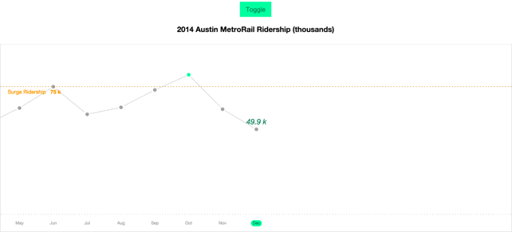

# PerchGraphs

A flexible graphing-driver, inspired by the [Perch app](https://vimeo.com/128847479), powered by [D3](https://github.com/mbostock/d3) and [Angular](https://github.com/angular/angular).

**PerchGraphs** handles all the parsing, translating, manipulating, interpolating, and other mathy-words-involving-[a-graph](https://www.youtube.com/watch?v=sIlNIVXpIns) for you. You just describe how to plot your data and let **PerchGraphs** do the rest.

## Installation

1. Install [Gulp](https://github.com/gulpjs/gulp) with `npm install -g gulp`.
2. Get the dependencies with `npm install`.
3. Uglify and concatenate with `gulp build`.
4. Run the example with `gulp serve`.

## Overview

Include the `mil.PerchGraphs` module into your module to get all that **PerchGraphs** has to offer.

**PerchGraphs** comes with two components: the `perchGraph` directive and the `PerchGraphStrategy` interface. `perchGraph` is decorated with one attribute, `strategy`, which is an object conforming to the `PerchGraphStrategy` interface.

## Reference

[The wiki](https://github.com/IBM-MIL/PerchGraphs/wiki) has a complete reference to all of PerchGraphs' components, as well as usage guidelines and requirements.

## License

Licensed Materials - Property of IBM
© Copyright IBM Corporation 2015. All Rights Reserved.

Licensed under the Apache License, Version 2.0 (the "License");
you may not use this file except in compliance with the License.
You may obtain a copy of the License at

   http://www.apache.org/licenses/LICENSE-2.0

Unless required by applicable law or agreed to in writing, software
distributed under the License is distributed on an "AS IS" BASIS,
WITHOUT WARRANTIES OR CONDITIONS OF ANY KIND, either express or implied.
See the License for the specific language governing permissions and
limitations under the License.
